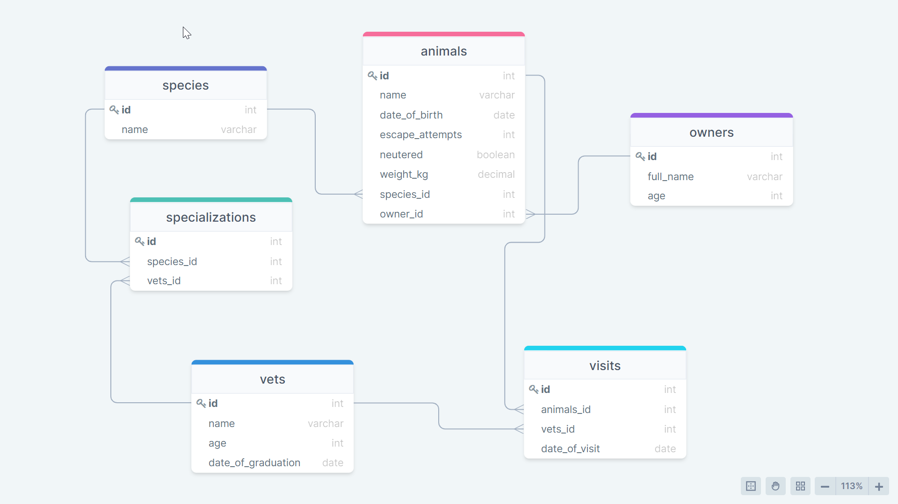

# vet_clinic_db-schema-diagram

## [This schema diagram is for my vet_clinic database](https://github.com/julie-ify/vet_clinic-database)

## Schema diagram

## Built With

- drawsql.app

## Author

👤 **Juliana Ifionu**

- GitHub: [@julie-ify](https://github.com/julie-ify)
- LinkedIn: [Juliana Ifionu](https://www.linkedin.com/in/juliana-ifionu-4a9492212/)

## 🤝 Contributing

Contributions, issues, and feature requests are welcome!

Feel free to check the [issues page](https://github.com/julie-ify/vet_clinic_db-schema-diagram/issues).

## Show your support

Give a ⭐️ if you like this project!

## Acknowledgments

- Coding partner, Standup and morning session team